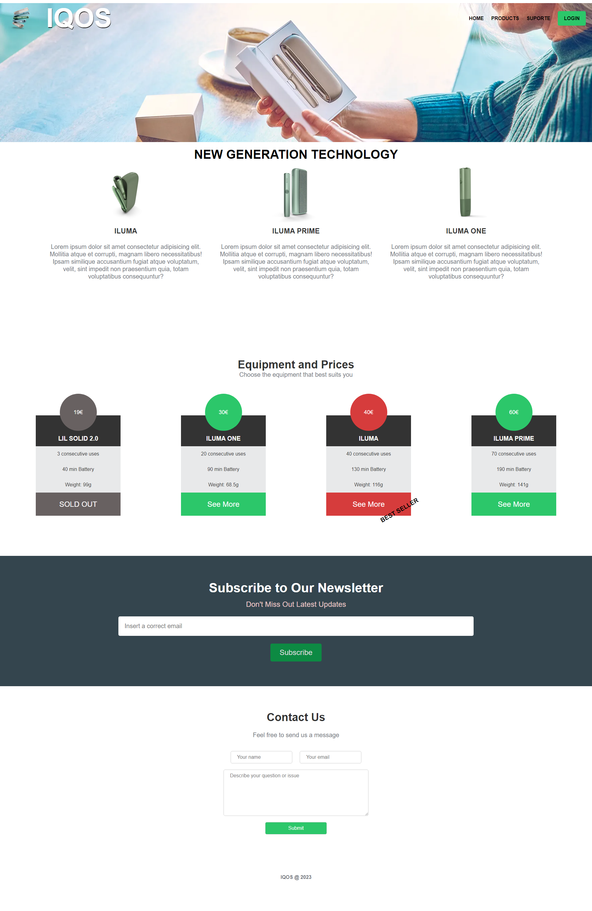

# Responsive-LandingPage
## 

The main objective of this project was to increase my knowledge to achieve a fully responsive website that adapts perfectly to different screen sizes, ex(Tablet , mobile or small laptops)

## Project Structure
- **index.html:** structure of the website.
- **styles.css:** Style file to enhance visual presentation and adapt to each screen.
  
## How to use:
1. Clone the repository: `git clone https://github.com/MiguelCapitao/Responsive-LandingPage.git`
2. Navigate to the project directory: `cd Responsive-LandingPage`
3. Open the `index.html` file in your browser.

